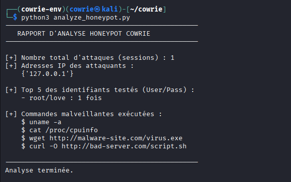

# 🛡️ Cowrie SSH Honeypot & Log Analysis

  

## 📌 Présentation du Projet
Ce projet a été réalisé dans le cadre de mes études en cybersécurité. L'objectif était de déployer un **Honeypot (Pot de miel)** pour analyser les techniques d'attaques par force brute sur le protocole SSH.

J'ai utilisé **Cowrie**, un honeypot à interaction moyenne, déployé sur une machine virtuelle **Kali Linux**.

### 📂 Contenu du dépôt
* `analyze_logs.py` : Mon script Python personnalisé pour extraire des statistiques des logs JSON.
* `Rapport_Projet_Cowrie.pdf` : Le rapport complet et détaillé du projet (Architecture, Attaque, Analyse).
* `evidence/` : Captures d'écran des preuves.

---

## 🚀 Fonctionnalités du Script d'Analyse
Le script Python développé (`analyze_logs.py`) permet de parser le fichier `cowrie.json` pour afficher automatiquement :
* 🚨 Le nombre de sessions d'attaques.
* 🌍 Les adresses IP des attaquants.
* 🔑 Le Top 5 des identifiants/mots de passe testés.
* 💻 L'historique des commandes shell exécutées par l'attaquant.

---

## 📸 Aperçu du Projet

### 1. Déploiement sur Kali Linux
L'environnement a été sécurisé avec un utilisateur dédié et un environnement virtuel Python.

### 2. Simulation d'Attaque
J'ai simulé une attaque par force brute et exécuté des commandes malveillantes (`wget`, `uname`, etc.).

### 3. Résultat de l'Analyse Automatique
Voici le résultat de mon script Python sur les données capturées :
 


---

## 🛠️ Installation & Utilisation

Pour tester le script d'analyse sur vos propres logs Cowrie :

```bash
# 1. Cloner le projet
git clone [https://github.com/TonPseudo/Cowrie-SSH-Honeypot-Analysis.git](https://github.com/TonPseudo/Cowrie-SSH-Honeypot-Analysis.git)

# 2. Lancer le script
python3 analyze_logs.py
